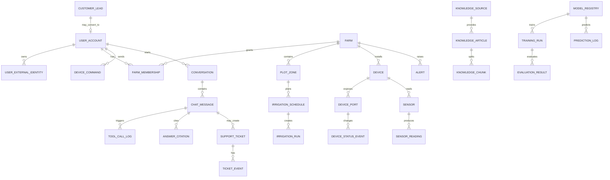

# 04. Thiết kế dữ liệu NextFarm SupportOps

## 1. Mục tiêu thiết kế

Thiết kế dữ liệu phải phục vụ đồng thời 3 việc:

1. Bám đúng hướng công ty: NextFarm là hệ sinh thái nông nghiệp số, không chỉ là cảm biến độ ẩm.
2. Bám đúng người dùng: nông dân/chủ vườn dùng điện thoại, hỏi tiếng Việt đời thường, không rành công nghệ.
3. Giải quyết đúng đề bài chatbot: chống bịa và truy dữ liệu IoT realtime đúng quyền.

## 2. Hai bài toán đề bài và yêu cầu dữ liệu

| Bài toán | Rủi ro nếu thiếu dữ liệu | Nhóm dữ liệu bắt buộc |
|---|---|---|
| A - Bot trả lời sai/bịa đặt | Bịa số liệu, bịa tính năng, khuyến nghị sai cây/vùng, mất niềm tin | Kho tri thức kiểm duyệt, nguồn/citation, glossary tiếng Việt nông nghiệp, tập kiểm thử, kết quả đánh giá, log câu trả lời |
| B - Không truy được dữ liệu IoT realtime | Không biết vườn của ai, đoán độ ẩm/van/lịch tưới, lộ dữ liệu khách khác | Identity, mapping Zalo/app -> user -> farm_id, quyền truy cập, sensor readings, device status, irrigation, command log, alerts |

## 3. Nguyên tắc dữ liệu

- Dữ liệu khách hàng là tài sản riêng: mọi truy vấn dữ liệu vườn phải qua phân quyền.
- Dữ liệu IoT là time-series: phải lưu theo thời gian, thiết bị, khu/lô và nguồn sinh dữ liệu.
- Tri thức chatbot phải có nguồn, trạng thái kiểm duyệt và phiên bản.
- AI không được chỉ có model artifact; phải lưu dataset, feature, training run, evaluation và prediction log.
- Chatbot không nói tên bảng DB cho người dùng cuối; bảng chỉ phục vụ backend/tool calling.
- Khi thiếu dữ liệu, schema phải cho phép chatbot biết thiếu cái gì và tạo ticket có ngữ cảnh.

## 4. Sơ đồ tổng thể dữ liệu

## 5. Nhóm dữ liệu Identity và phân quyền

Mục tiêu: chatbot biết người đang chat là ai, có phải khách hàng không, được xem vườn nào.

| Bảng | Ý nghĩa | Trường chính |
|---|---|---|
| `identity.user_accounts` | Người dùng hệ thống: khách hàng, kỹ thuật viên, quản lý/admin | user_id, display_name, phone, user_type, status |
| `identity.user_external_identities` | Liên kết Zalo OA, app NextFarm, số điện thoại, thiết bị đăng nhập | external_id, provider, provider_user_id, user_id |
| `identity.roles` | Vai trò: customer, technician, manager, admin | role_id, role_name |
| `identity.permissions` | Quyền thao tác: read_farm_data, request_control, manage_ticket | permission_id, permission_code |
| `identity.user_roles` | Gán role cho user | user_id, role_id |
| `identity.farm_memberships` | User được truy cập farm nào, vai trò gì | farm_id, user_id, farm_role |
| `identity.customer_leads` | Khách mới chưa có DB chính, nhập form chat | lead_id, full_name, phone, region, note, status |
| `identity.access_audit_logs` | Log mỗi lần chatbot đọc dữ liệu nhạy cảm | actor_user_id, farm_id, action, decision, reason |

Ứng dụng vào chatbot:

- Khách mới: lưu vào `customer_leads`, được hỏi tri thức chung.
- Khách hàng: mapping phone/Zalo -> `user_accounts` -> `farm_memberships` -> farm_id.
- Nếu không có quyền: chatbot nói không có quyền thay vì đọc nhầm dữ liệu.

## 6. Nhóm dữ liệu Farm/GIS/cây trồng

Mục tiêu: chatbot hiểu "vườn của tôi", "khu B", "lô L-12", cây gì, diện tích bao nhiêu.

| Bảng | Ý nghĩa | Trường chính |
|---|---|---|
| `farm.farms` | Hồ sơ vườn/trang trại | farm_id, farm_name, owner_user_id, region, address, area_ha |
| `farm.plot_zones` | Khu/lô trên GIS | zone_id, farm_id, zone_code, crop_id, area_ha, geometry_json |
| `farm.crops` | Danh mục cây trồng | crop_id, crop_name, crop_group |
| `farm.crop_cycles` | Vụ mùa/giai đoạn canh tác | cycle_id, farm_id, crop_id, start_date, growth_stage |
| `farm.farm_assets` | Tài sản gắn với vườn: bơm, bể nước, nhà màng | asset_id, farm_id, asset_type, status |

Ứng dụng vào chatbot:

- Câu "khu B có thiếu nước không" map `zone_code=B`.
- Câu "62% độ ẩm là cao hay thấp" cần biết crop/growth_stage/soil hoặc ngưỡng mục tiêu.
- Câu tư vấn khách mới "vườn rau 1 ha" dùng crop/area để đề xuất cấu hình.

## 7. Nhóm dữ liệu thiết bị IoT và realtime

Mục tiêu: giải quyết bài toán B.

| Bảng | Ý nghĩa | Nhịp cập nhật |
|---|---|---|
| `iot.devices` | Bộ điều khiển ESP32/NMC/Fertikit/gateway | Tĩnh + khi lắp đặt |
| `iot.device_ports` | Cổng ra: van, bơm, van châm phân | Tĩnh + khi cấu hình |
| `iot.sensors` | Cảm biến RS485/Modbus: độ ẩm, nhiệt độ, EC, pH, lưu lượng | Tĩnh + khi cấu hình |
| `iot.sensor_readings` | Số đo cảm biến theo thời gian | Khoảng 10 phút/lần hoặc theo cấu hình |
| `iot.device_status_events` | Online/offline, trạng thái từng cổng | Liên tục, khoảng vài giây |
| `iot.irrigation_schedules` | Lịch tưới cấu hình | Khi người dùng cấu hình |
| `iot.irrigation_runs` | Ca tưới đã chạy | Theo sự kiện |
| `iot.device_commands` | Nhật ký lệnh điều khiển | Theo sự kiện |
| `iot.alerts` | Mất kết nối, vượt ngưỡng, sensor câm | Theo sự kiện |
| `iot.data_quality_flags` | Cờ dữ liệu thiếu/trễ/bất thường | Theo batch/stream |

Thiết kế quan trọng:

- `sensor_readings` phải có timestamp, farm_id, zone_id, device_id, sensor_id, metric_type, value, unit, quality.
- `device_status_events` phải có last_seen/online/running để chatbot biết dữ liệu có cũ không.
- `device_commands` bắt buộc có requested_by, confirmed_at, status, firmware_rule_checked.
- `alerts` phải có severity, suggested_checklist_id, status, resolved_at.

## 8. Nhóm dữ liệu Knowledge/RAG chống bịa

Mục tiêu: giải quyết bài toán A.

| Bảng | Ý nghĩa |
|---|---|
| `knowledge.product_modules` | Danh mục nền tảng NextFarm: GIS, tưới, NMC, Fertikit, Management, Yield, QR, AI sâu bệnh, Weather |
| `knowledge.knowledge_sources` | Nguồn tài liệu: website, manual, runbook, FAQ, chuyên gia kiểm duyệt |
| `knowledge.knowledge_articles` | Bài tri thức đã chuẩn hóa |
| `knowledge.knowledge_chunks` | Đoạn nhỏ để retrieval |
| `knowledge.chunk_embeddings` | Vector embedding để tìm kiếm ngữ nghĩa |
| `knowledge.glossary_terms` | Thuật ngữ: EC, pH, NMC, Modbus, MQTT, VietGAP |
| `knowledge.local_language_aliases` | Từ địa phương/không dấu/viết tắt: "béc", "đầu nhỏ giọt", "van bị lì" |
| `knowledge.review_workflows` | Ai kiểm duyệt, phiên bản nào, trạng thái approved/draft/deprecated |

Nguyên tắc:

- Bot chỉ trả lời tri thức chuyên môn từ article/chunk `approved`.
- Câu trả lời nội bộ có citation; câu trả lời người dùng nói nhẹ nhàng, không cần phô kỹ thuật.
- Nếu retrieval score thấp, bot hỏi thêm hoặc nói chưa đủ dữ liệu.

## 9. Nhóm dữ liệu hội thoại và tool calling

Mục tiêu: biết bot đã hiểu gì, gọi API nào, trả lời bằng nguồn nào.

| Bảng | Ý nghĩa |
|---|---|
| `chat.conversations` | Một phiên chat theo user/lead/kênh |
| `chat.chat_messages` | Tin nhắn user/bot/system |
| `chat.intent_events` | Ý định nhận diện: knowledge_query, farm_data_query, control_command, ticket_request |
| `chat.tool_call_logs` | Bot đã gọi service nào, request/response ra sao |
| `chat.answer_citations` | Câu trả lời dựa trên article/chunk/sensor/alert nào |
| `chat.handoff_contexts` | Ngữ cảnh chuyển sang ticket/kỹ thuật viên |

Ứng dụng:

- Chứng minh chống bịa: mỗi câu trả lời có citation hoặc tool_call.
- Debug: nếu bot trả lời sai, xem intent/tool/source.
- Làm dataset train: từ hội thoại thật đã gắn nhãn.

## 10. Nhóm dữ liệu SupportOps/ticket/SLA

Mục tiêu: biến chatbot thành hệ thống hỗ trợ, không chỉ trả lời.

| Bảng | Ý nghĩa |
|---|---|
| `support.support_tickets` | Ticket sự cố/hỗ trợ |
| `support.ticket_events` | Lịch sử thay đổi trạng thái ticket |
| `support.ticket_checklists` | Checklist ban đầu theo nhóm lỗi |
| `support.ticket_checklist_items` | Các bước kiểm tra cụ thể |
| `support.resolution_notes` | Cách xử lý cuối cùng sau khi đóng ticket |
| `support.similar_ticket_links` | Ticket tương tự để gợi ý cách xử lý |
| `support.sla_policies` | SLA theo priority/severity/customer tier |

Ứng dụng vào đề bài:

- Thiết kế quy trình tiếp nhận và xử lý ticket.
- Chuẩn hóa sản phẩm, địa điểm, lỗi, ưu tiên.
- Tự động phân loại nội dung sự cố.
- Gợi ý checklist kiểm tra ban đầu.
- Tìm sự cố tương tự đã giải quyết.
- Thống kê thời gian phản hồi/xử lý và nhóm lỗi thường gặp.

## 11. Nhóm dữ liệu AI/model

Mục tiêu: không để thư mục model đơn sơ; phải chứng minh sẵn sàng nhận dữ liệu lớn.

| Bảng | Ý nghĩa |
|---|---|
| `ai.model_registry` | Danh mục model: intent, rerank, forecast, alert, recommendation |
| `ai.dataset_versions` | Phiên bản dataset dùng để train/test |
| `ai.feature_snapshots` | Feature đã trích xuất theo thời gian |
| `ai.training_runs` | Lần train, tham số, artifact, metric |
| `ai.evaluation_sets` | Bộ test cố định theo đề bài |
| `ai.evaluation_results` | Kết quả pass/fail, accuracy, hallucination rate, latency |
| `ai.prediction_logs` | Model dự đoán gì trong thực tế, độ tin cậy bao nhiêu |

Các model nên có:

| Model | Mục đích | Dữ liệu vào | Kết quả ra |
|---|---|---|---|
| Intent & Slot Model | Hiểu câu hỏi tiếng Việt nông nghiệp | chat_messages đã gắn nhãn, glossary, aliases | intent, zone, device, action, thời gian |
| Retrieval/Rerank Model | Tìm tri thức đúng | knowledge_chunks, câu hỏi | top_k chunks + score |
| Moisture Forecast Model | Dự báo độ ẩm 1-3 giờ | sensor_readings, irrigation_runs, weather | forecast, risk |
| Alert Root Cause Model | Gợi ý nguyên nhân sự cố | alerts, status, readings, lịch tưới | nguyên nhân khả dĩ, checklist |
| Recommendation Model | Gợi ý bước tiếp theo | farm profile, crop, module usage, ticket history | tư vấn triển khai/hành động |

## 12. Mapping yêu cầu đề bài sang bảng dữ liệu

| Yêu cầu đề bài | Bảng/nhóm dữ liệu đáp ứng |
|---|---|
| Thiết kế quy trình tiếp nhận và xử lý ticket | support_tickets, ticket_events, handoff_contexts |
| Chuẩn hóa thông tin theo sản phẩm, địa điểm, lỗi, ưu tiên | product_modules, farms, plot_zones, alerts, ticket_categories, sla_policies |
| Tự động phân loại nội dung sự cố | intent_events, ai.model_registry, prediction_logs |
| Gợi ý checklist kiểm tra ban đầu | ticket_checklists, ticket_checklist_items, alert_root_cause model |
| Tìm sự cố tương tự đã được giải quyết | resolution_notes, similar_ticket_links, embeddings |
| Xây dựng kho tri thức từ ticket đã đóng | resolution_notes -> knowledge_articles/chunks sau kiểm duyệt |
| Thống kê thời gian phản hồi/xử lý và nhóm lỗi thường gặp | support_tickets, ticket_events, sla_policies |
| Phân quyền và ẩn dữ liệu khách hàng | user_accounts, farm_memberships, access_audit_logs |
| Hỏi đáp dữ liệu vườn realtime | sensor_readings, device_status_events, irrigation_runs, alerts |
| Điều khiển thiết bị bằng hội thoại | device_commands, permissions, access_audit_logs |
| Chống bịa | knowledge_sources, answer_citations, evaluation_results |

## 13. Luồng dữ liệu khi người dùng chat

### Khách mới

1. Nhập tên, điện thoại, khu vực.
2. Tạo `customer_leads`.
3. Chatbot trả lời bằng `knowledge` và hỏi thêm nhu cầu.
4. Nếu khách muốn tư vấn, tạo `support_tickets` loại sales/consulting.
5. Khi công ty xác nhận khách hàng, lead được convert thành user/farm.

### Khách hàng đã xác minh

1. Nhập số điện thoại hoặc mở từ app/Zalo đã liên kết.
2. Tra `user_external_identities` và `farm_memberships`.
3. Nếu hỏi tri thức: dùng `knowledge`.
4. Nếu hỏi dữ liệu: gọi `farm_data` theo farm_id/zone/device.
5. Nếu điều khiển: kiểm tra permission, tạo `device_commands` dạng draft, yêu cầu xác nhận.
6. Nếu thiếu dữ liệu/rủi ro: tạo ticket kèm `handoff_contexts`.

## 14. Quy tắc nghiệm thu dữ liệu

- Không có truy vấn dữ liệu vườn nào thiếu log phân quyền.
- Mỗi câu trả lời tri thức phải truy được nguồn approved.
- Mỗi câu trả lời dữ liệu vườn phải gắn được farm_id và source record.
- Sensor realtime có timestamp, nếu quá hạn thì bot phải báo dữ liệu cũ.
- Ticket phải có category, priority, farm/lead context, checklist hoặc lý do chưa có checklist.
- Evaluation set phải đo: accuracy dữ liệu vườn, hallucination rate, latency, permission leakage.
