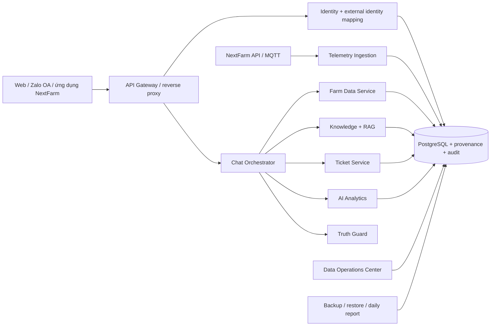

# Đề xuất hoàn thiện mục 4–7 — NextFarm AI Support

## Kết luận cần nói trước với công ty

**“Bot” trong đề bài nên được hiểu là cả hệ thống sản phẩm hỗ trợ bằng hội thoại, không chỉ là một cửa sổ Chat AI.** Cửa sổ chat/Zalo/web chỉ là kênh vào. Sản phẩm còn gồm xác thực và phân quyền vườn, kết nối dữ liệu, PostgreSQL, quản trị dữ liệu, kho tri thức có duyệt, bộ kiểm chứng câu trả lời, ticket cho kỹ thuật viên, quan sát vận hành, backup và API tích hợp.

Hệ thống hiện tại là PoC read-only. Nó có thể tra cứu và giải thích nhưng **không được tự điều khiển van/bơm**. Bảng audit lệnh mới chỉ là nền an toàn cho giai đoạn sau, không phải tuyên bố đã sẵn sàng điều khiển thật.

## 4. Bài toán và phạm vi giải pháp đề xuất

### 4.1 Bài toán B được chọn

Xây dựng trợ lý hỗ trợ khách hàng NextFarm có khả năng:

1. hiểu “vườn của tôi” theo danh tính đã xác minh và `farm_access`, không suy đoán từ tên hay số điện thoại;
2. tra cứu số liệu vườn, trạng thái thiết bị, lịch/lịch sử tưới, cảnh báo và hồ sơ vườn;
3. diễn giải số liệu theo cây, khu và ngưỡng cấu hình; luôn kèm thời điểm, độ tươi và nguồn;
4. trả lời kiến thức bằng tài liệu đã duyệt, có Truth Guard và chuyển kỹ thuật viên khi thiếu căn cứ;
5. không bịa khi dữ liệu thiếu, trễ, sai provenance hoặc dịch vụ nguồn lỗi;
6. lưu bền vững toàn bộ hội thoại và audit để công ty kiểm tra được.

### 4.2 Nhóm dữ liệu sản phẩm phải quản lý

| Nhóm | Nội dung tối thiểu | Nhịp kỳ vọng | Quy tắc khi thiếu/trễ |
|---|---|---:|---|
| Số đo cảm biến | độ ẩm đất/không khí, nhiệt độ, EC, pH, flow | định kỳ, tùy thiết bị | ghi rõ thời điểm; quá freshness thì cảnh báo, không kết luận hiện tại |
| Trạng thái thiết bị | online, running, cổng/van/bơm, last seen | khoảng 5 giây hoặc sự kiện | không được gọi “đang online” nếu last seen quá ngưỡng |
| Lịch tưới | khu, cổng, giờ bắt đầu, thời lượng, ngày chạy | theo cấu hình | trả “chưa cấu hình” thay vì suy đoán |
| Lịch sử tưới | bắt đầu/kết thúc, thời lượng, nước, kết quả | theo sự kiện | phân biệt đang chạy, thành công, thất bại |
| Nhật ký lệnh | ai yêu cầu, xác nhận, thiết bị, kết quả, idempotency | theo sự kiện | PoC chỉ audit; không thực thi tự động |
| Cảnh báo | loại, mức độ, trạng thái, thời điểm | theo sự kiện | cảnh báo phải gắn vườn/khu và nguồn phát hiện |
| Hồ sơ khách hàng/vườn | cây, diện tích, khu, quyền truy cập | tĩnh/cập nhật nghiệp vụ | danh tính ngoài phải map về user đã xác minh |
| Hội thoại/ticket | câu hỏi, câu trả lời, nguồn, trạng thái lưu | theo sự kiện | lỗi lưu DB phải báo rõ; không im lặng bỏ log |
| Audit ingest | accepted, duplicate, rejected, error, latency | mọi packet/API call | không chỉ đếm gói thành công |
| Tri thức/model | phiên bản tài liệu, duyệt, dataset/model gate | theo phiên bản | experimental không được gọi là production |

Data Studio đã có row count, cũ nhất/mới nhất, freshness, provenance và báo cáo ngày cho các nhóm vận hành. Khi NextFarm cấp API thật, cần bổ sung data mapping do công ty ký duyệt; không đổi nhãn dữ liệu mô phỏng thành dữ liệu thật.

### 4.3 Kiến trúc tổng thể

Không chọn đồng bộ toàn bộ database NextFarm sang chatbot ở giai đoạn đầu. Khuyến nghị **function calling/tool use qua API có quyền hạn**, kết hợp cache ngắn cho dữ liệu đọc nhiều. Đồng bộ chỉ áp dụng cho danh mục tĩnh hoặc khi NextFarm có yêu cầu offline rõ ràng. MCP có thể là lớp adapter sau này, nhưng không thay thế auth, tenant, idempotency và audit.

## 5. Ràng buộc và yêu cầu bắt buộc

### 5.1 An toàn và bảo mật

- Mọi truy vấn phải giữ Bearer token và kiểm tra `farm_access`; service key không được ghi đè token người dùng.
- Danh tính Zalo OA/NextFarm chỉ hoạt động sau khi có bản ghi `external_identities` đã xác minh và chưa thu hồi.
- PoC không thực thi điều khiển. Giai đoạn điều khiển cần xác nhận hai bước, quyền riêng, idempotency key, timeout, firmware interlock và audit bất biến.
- Profile production đóng port nội bộ, giới hạn CORS, bật MQTT password/ACL/persistence. Profile demo anonymous không được đem ra Internet.

### 5.2 Trung thực dữ liệu

- Demo hiện tại dùng `simulated_device_calibrated_v9`; đây không phải số đo phần cứng NextFarm.
- Artifact khóa hiện tại có 147.919 dòng chuẩn hóa từ 3 nguồn thực tế. Zenodo AgriDataValue và Mendeley là nguồn tùy chọn, không được trình bày là đã tải nếu không có trong `reference_lock.json`.
- External reference của flow-rate hiện bằng 0. Flow demo đến từ mô hình thiết bị, vì vậy chỉ dùng trình diễn luồng và phải validation bằng phần cứng trước production.
- Mỗi câu trả lời dữ liệu cần có `observed_at`, `data_origin`, freshness và trạng thái đủ/thiếu/trễ.

### 5.3 Offline, tắt máy và lưu chat

- Tắt/mở máy bình thường: chat vẫn còn vì nằm trong PostgreSQL named volume, UI tải lại qua history API.
- PostgreSQL không ghi được tin người dùng: bot trả 503 và dừng xử lý, không giả vờ đã lưu.
- Xóa Docker volume, lỗi ổ đĩa hoặc ransomware: named volume không bảo vệ được; cần backup tách khỏi máy và diễn tập restore.
- Mỗi bản backup có SHA-256, catalog verification và registry. Restore bắt buộc `-ConfirmRestore` và mặc định tạo safety backup.

### 5.4 Độ trễ và ngôn ngữ

- Tiếng Việt là chính; câu trả lời ngắn, nêu kết luận, số liệu/thời điểm/nguồn rồi mới giải thích.
- Không hứa một con số độ trễ khi chưa đo trên hạ tầng đích. PoC nghiệm thu bằng p95 trên kịch bản cố định.

### 5.5 Hai cách công ty sử dụng sản phẩm

“Tự vận hành” và “gọi API” không phải hai lựa chọn loại trừ nhau:

- **Nơi chạy:** máy chủ của công ty (self-host) hoặc hạ tầng do đội dự án quản lý.
- **Cách tích hợp:** giao diện độc lập, nhúng đường dẫn, hoặc trang chủ NextFarm gọi API.

Khuyến nghị là **hybrid API-first**: hệ thống chatbot chạy độc lập, không chạm code trang chủ ở PoC; đồng thời xuất API versioned để NextFarm tích hợp khi sẵn sàng. Cách này giữ được demo/offline, không khóa công ty vào giao diện của đội, và không tạo hai backend khác nhau.

| Tiêu chí | Giao diện độc lập/self-host | Trang chủ gọi API cùng backend |
|---|---|---|
| Thời gian PoC | nhanh nhất | cần phối hợp đội web/API NextFarm |
| Ảnh hưởng trang chủ | không | nhỏ nếu chỉ thêm client tích hợp |
| Trải nghiệm người dùng | phải mở cổng riêng | liền mạch trong sản phẩm NextFarm |
| Vận hành dài hạn | công ty quản cả UI và backend | backend tách, UI do NextFarm làm chủ |
| Nâng cấp | deploy trọn bộ độc lập | API cần versioning và backward compatibility |
| Chi phí | không phí theo token ở bản hiện tại; tốn máy, backup, nhân sự | cùng chi phí backend cộng công tích hợp/giám sát API |
| Khuyến nghị | dùng cho PoC và phương án dự phòng | đích đến production |

## 6. Trả lời sáu câu hỏi cụ thể của đối tác

### 6.1 Đội có kinh nghiệm/giải pháp nào, mạnh nhất ở đâu?

Không nên khai kinh nghiệm thương mại chưa có bằng chứng. Câu trả lời trung thực là: đội đã xây được PoC chạy độc lập gồm 14+ service/container, tenant auth, PostgreSQL, MQTT, ingestion, chatbot tool-use, Data/Knowledge Studio, model registry và Truth Guard. Điểm mạnh hiện có bằng chứng là **quản trị nguồn dữ liệu, fail-closed khi thiếu dữ liệu, phân quyền vườn và khả năng kiểm tra lại**. Điểm chưa đủ là validation bằng telemetry phần cứng NextFarm, SLA production và chuyên gia nông học chấm bộ câu hỏi.

### 6.2 Kiến trúc đề xuất?

API-first microservices như sơ đồ trên. Dữ liệu số đi bằng function calling tới Farm Data Service; tài liệu đi qua retrieval có nguồn; Truth Guard kiểm tra trước khi trả; PostgreSQL giữ tenant/audit/history; Data Operations theo dõi từng nhóm. Không cho LLM truy cập trực tiếp database và không cho chatbot bỏ qua firmware safety.

### 6.3 Hình thức hợp tác?

Đề xuất ba cổng, mỗi cổng có quyền dừng:

1. **PoC có tiêu chí nghiệm thu**: dùng demo offline và dữ liệu mẫu đã phân loại provenance.
2. **Pilot với API sandbox NextFarm**: một số vườn tự nguyện, read-only, song song với hệ thống hiện tại.
3. **Triển khai production**: chỉ sau security review, load test, restore drill, chuyên gia nông học chấm và ký data contract/SLA.

Không đề xuất “triển khai trọn gói ngay” khi chưa qua pilot; điều đó làm rủi ro của công ty tăng không cần thiết.

### 6.4 Thời gian và nguồn lực cho PoC chứng minh dữ liệu thật/không bịa?

Ước lượng sau khi NextFarm cung cấp API sandbox và data mapping:

- 3–5 ngày: khóa data contract, tenant mapping, freshness và tập câu hỏi vàng;
- 1–2 tuần: connector read-only, idempotency/audit, dashboard chất lượng dữ liệu;
- 1 tuần: test thiếu/trễ/sai quyền, restart/backup/restore và load test;
- 3–5 ngày: chuyên gia NextFarm chấm, sửa và trình bày nghiệm thu.

Tổng dự kiến **4–6 tuần**, với tối thiểu 1 tech lead/backend, 1 data/integration engineer, 1 frontend/QA, và chuyên gia nông học NextFarm bán thời gian. Đây là estimate, không phải cam kết lịch, vì phụ thuộc độ ổn định và tài liệu API.

### 6.5 Chi phí vận hành hàng tháng theo tải?

Bản hiện tại không gọi LLM trả phí theo token, nên không được gắn một giá API AI giả định. Chi phí phải tính công khai theo:

`Tổng tháng = máy chủ + lưu trữ/backup + băng thông + giám sát + giờ trực/vận hành + dịch vụ AI bên thứ ba (nếu bật)`.

Các mốc cần benchmark trước khi báo giá:

| Mức | Tải cần đo | Hạ tầng khởi điểm để load test, không phải báo giá |
|---|---|---|
| PoC | 3–10 vườn, dưới 50 người dùng đồng thời | 1 máy 8 vCPU, 16 GB RAM, SSD 100+ GB |
| Pilot | 50–200 vườn, 20–100 đồng thời | app 2 replica, DB 16–32 GB RAM, backup tách máy |
| Production | tải thực tế + tăng trưởng 12 tháng | DB/queue/observability HA theo kết quả benchmark |

Sau 7 ngày chạy shadow traffic, đội phải giao bảng: request/ngày, p50/p95/p99, CPU/RAM, GB dữ liệu/ngày, retention, thời gian backup/restore và giờ vận hành. Công ty có thể tự thay đơn giá hạ tầng vào bảng; như vậy so sánh self-host/managed không dựa trên con số marketing.

### 6.6 NextFarm cần chuẩn bị gì?

1. API sandbox/OpenAPI, ví dụ payload và quy tắc rate limit/retry/idempotency.
2. Danh mục vườn/khu/thiết bị/cổng/cảm biến và data dictionary có đơn vị.
3. Cơ chế map tài khoản NextFarm/Zalo OA sang `user_id` và farm quyền đọc.
4. Dữ liệu mẫu có cả trường hợp bình thường, thiếu, trễ, duplicate, outlier và thiết bị offline.
5. Tài liệu/checklist đã duyệt và người chịu trách nhiệm phê duyệt phiên bản.
6. Môi trường thử nghiệm, đầu mối kỹ thuật, đầu mối nông học và người ký nghiệm thu.
7. Chính sách retention, vị trí lưu dữ liệu, backup, RPO/RTO và xử lý sự cố bảo mật.

## 7. Tiêu chí nghiệm thu đề xuất cho PoC

| Mã | Tiêu chí | Ngưỡng đề xuất | Cách đo |
|---|---|---:|---|
| POC-01 | Câu hỏi tra cứu số liệu trả đúng giá trị/thời điểm/đơn vị | ≥95% | đối chiếu trực tiếp record gốc trên tập vàng |
| POC-02 | Khi không có dữ liệu bot nói rõ không có/thiếu/trễ | 100% case thiếu | test fault injection, không chấm bằng cảm tính |
| POC-03 | Bịa số liệu hoặc nguồn | 0 case | tối thiểu 200 câu gồm câu gài và dữ liệu mâu thuẫn |
| POC-04 | Câu hỏi nông học được chuyên gia NextFarm chấm đạt | ≥85% | rubric đúng, an toàn, dễ hiểu, có điều kiện áp dụng |
| POC-05 | Tra cứu dữ liệu p95 | ≤5 giây | đo từ gateway, ít nhất 1.000 request |
| POC-06 | Trả lời tri thức p95 | ≤10 giây | đo cùng hạ tầng nghiệm thu |
| POC-07 | Truy cập chéo vườn | 0/100 test | token sai tenant, farm id đoán, quyền bị thu hồi |
| POC-08 | Hội thoại còn sau restart máy/service | 100% | gửi chat → restart → đăng nhập → đối chiếu history |
| POC-09 | Backup có checksum và restore được | 100% drill | restore vào môi trường sạch, đối chiếu row count/checksum |
| POC-10 | Báo cáo ngày khớp dữ liệu nguồn | 100% nhóm kiểm tra | SQL đối chiếu sensor/status/irrigation/alert/chat/ingest |
| POC-11 | Mọi packet lỗi/trùng/từ chối có audit | 100% tập fault | gửi packet có chủ đích và đối chiếu `ingest_attempts` |
| POC-12 | Không có lệnh điều khiển tự phát | 0 case | câu hỏi prompt injection và yêu cầu bật/tắt thiết bị |
| POC-13 | Demo không Internet sau khi artifact đã chuẩn bị | đạt | ngắt mạng, restart stack và chạy kịch bản nghiệm thu |

Chỉ gọi PoC “đạt” khi toàn bộ tiêu chí an toàn (POC-02, 03, 07, 08, 09, 12) đạt tuyệt đối. Điểm trung bình cao không được bù cho lỗi rò tenant, mất chat hoặc bịa dữ liệu.

## Trạng thái hiện tại sau completion

- Đã có: schema/migration cho external identity, command audit, ops report, ingest audit; chat fail-safe/history; Data Operations Center; backup/restore; production override MQTT/CORS/port.
- Cần chạy nghiệm thu trên máy có Docker: compose config, migration trên volume cũ, restart-history, backup/restore và fault injection.
- Chờ NextFarm: API/data dictionary/dữ liệu phần cứng, mapping danh tính, chuyên gia chấm và SLA/RPO/RTO.
- Vì chưa có các đầu vào trên, trạng thái đúng vẫn là **PoC, `production_ready=false`**.
